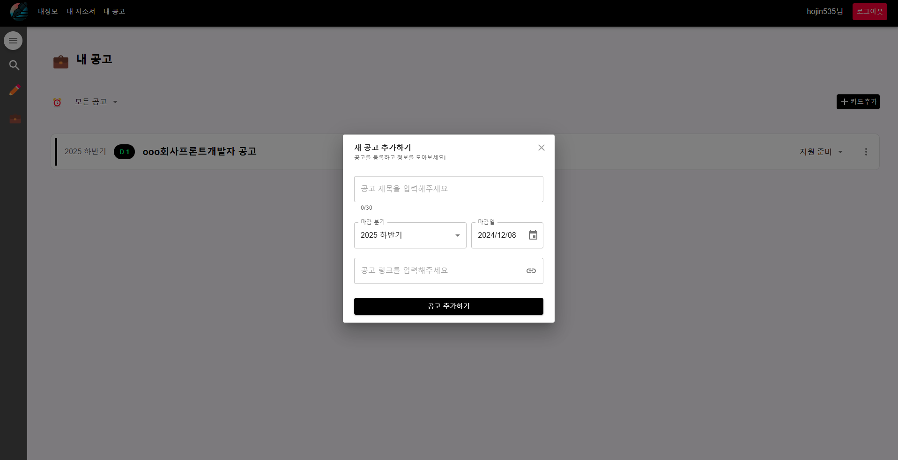

# Javis - 자소서 비서 서비스

### 백엔드 리포지토리: https://github.com/hojin535/javis-backend
## 배경

Javis는 자소서 비서 서비스의 줄임말로, 취업 준비자들을 위한 아카이빙 웹 서비스입니다. 취업 준비 과정에서 자소서를 새롭게 작성하거나 기존 자소서를 찾기 힘들어하는 문제를 해결하고자 탄생했습니다.  
취업 준비자들이 자주 경험하는 어려움은 자소서 작성에 필요한 정보나 경험들을 체계적으로 관리하지 못하는 점입니다. 기업들이 요구하는 개인 정보(한자 이름, 취득 자격증, 수상 경력 등)와 자소서 작성에 필요한 다양한 경험들을 한 곳에 아카이빙하고, 이를 쉽게 찾고 활용할 수 있도록 돕는 것이 Javis의 핵심 기능입니다.

## 사용 기술

- React.js
- Recoil
- Material-UI (Mui)
- Styled-Component
- dynamodb
- jenkins
- Oracle Cloud Instance
## 상태

개발 중

---

## 결과물

### 로그인화면 / 회원가입 화면

| 로그인 화면 | 회원가입 화면 |
|-------------|--------------|
|  |  |

### 내 정보

| 내 정보 |
|---------|
|  |
|  |

### 내 자소서

| 내 자소서 |
|-----------|
|  |
|  |

### 내 공고

| 내 공고 |
|---------|
|  |
|  |
|  |

### 에디터

| 에디터 |
|--------|
|  |

### 사이드 메뉴

| 내자소서 | 내공고 |
|-------------|-------------|
|  |  |

### 검색

| 검색 |
|------|
|  |
|  |
|  |
|  |
